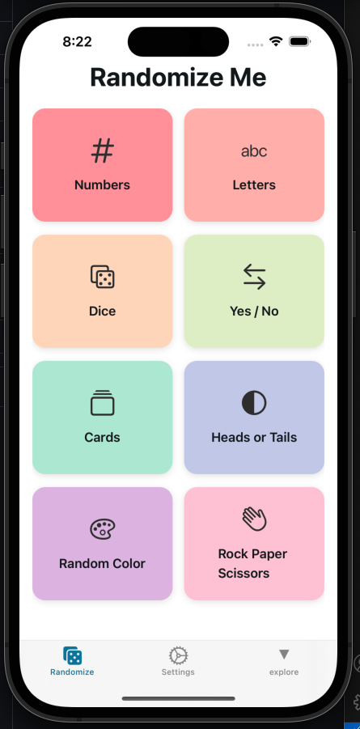
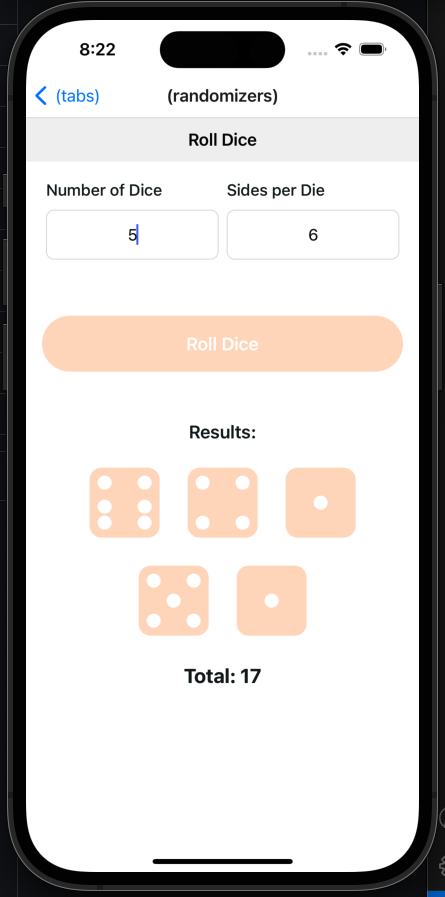
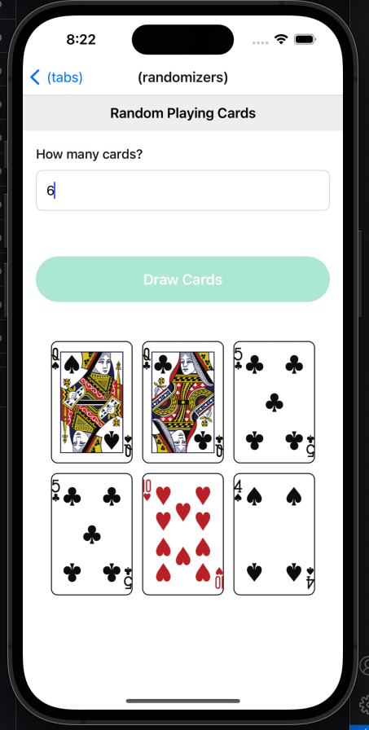
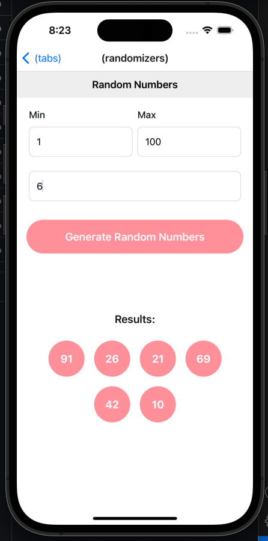

# Randomize Me

Randomize Me is a playful and colorful mobile application that allows users to randomize various elements. The app provides a modern and intuitive interface for generating random numbers, letters, dice rolls, yes/no answers, playing cards, coin flips, colors, and rock-paper-scissors outcomes.

## Features

- **Numbers**: Generate one or several random numbers within a specified range.
- **Letters**: Generate one or several random letters with options for uppercase and lowercase.
- **Dice**: Roll one or several dice with customizable sides.
- **Yes/No**: Get a random yes or no answer.
- **Playing Cards**: Draw one or several random playing cards.
- **Heads or Tails**: Flip a coin to get heads or tails.
- **Color**: Generate a random color with its hex and RGB values.
- **Rock, Paper, Scissors**: Play a game of rock-paper-scissors against the computer.

## Screens

- **Home Screen**: The main page with 8 big buttons leading to different randomizer screens.
- **Settings Screen**: A screen to view app information and settings.
- **Splash Screen**: A nice-looking splash screen displayed when the app is launched.






## Installation

1. Clone the repository:

   ```bash
   git clone https://github.com/your-username/randomize-me.git
   cd randomize-me
   ```

2. Install dependencies:

   ```bash
   npm install
   ```

3. Start the development server:

   ```bash
   npm start
   ```

## Technologies Used

- **React Native**: For building the mobile application.
- **Expo**: For development and build tools.
- **TypeScript**: For type-safe JavaScript development.
- **Expo Router**: For navigation and routing.
- **Expo Haptics**: For providing haptic feedback.

## Contributing

Contributions are welcome! Please fork the repository and submit a pull request with your changes.

## License

This project is licensed under the MIT License. See the [LICENSE](LICENSE) file for details.

## Acknowledgements

- Thanks to the open-source community for providing the tools and libraries used in this project.
